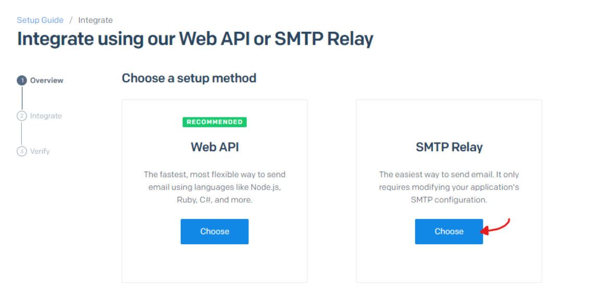
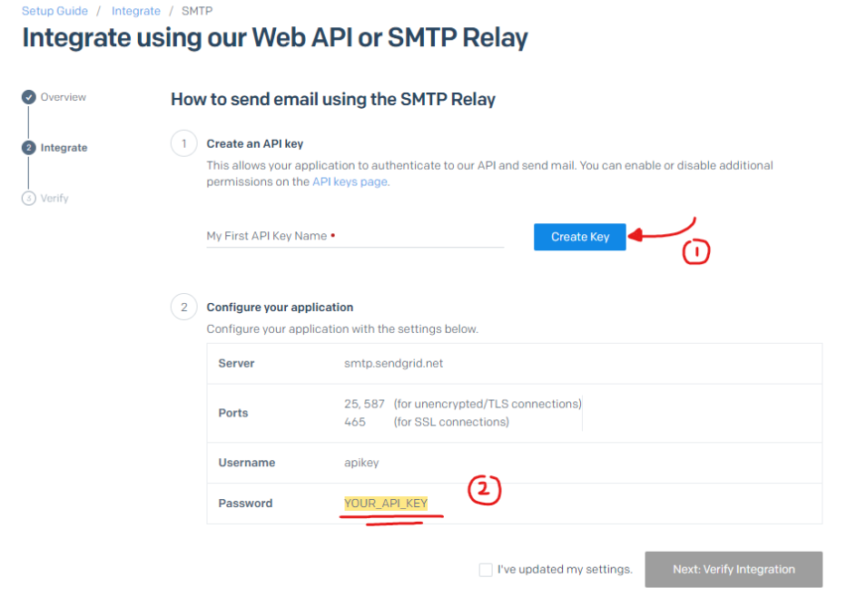
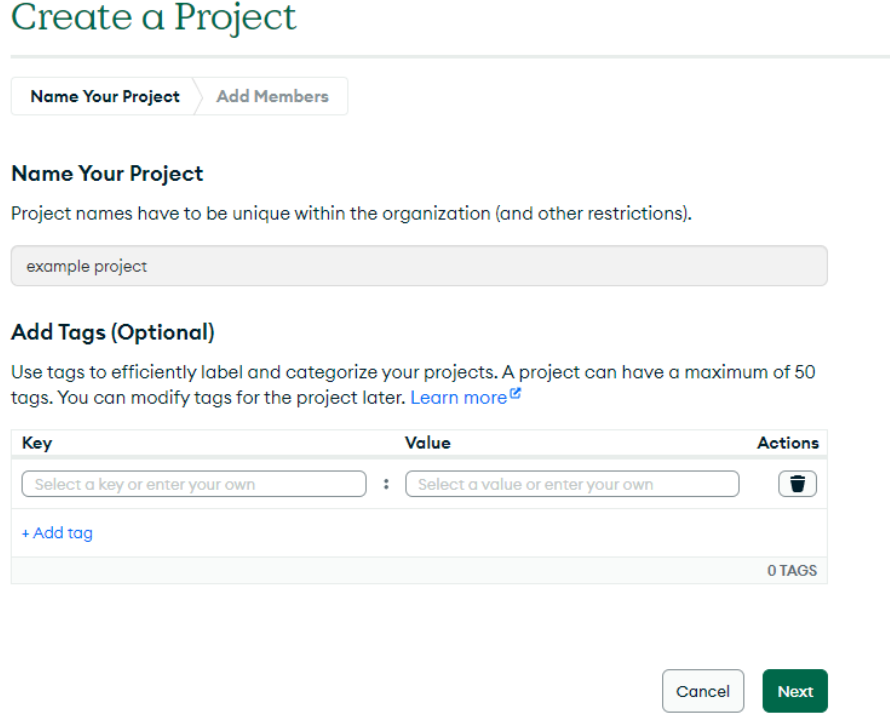
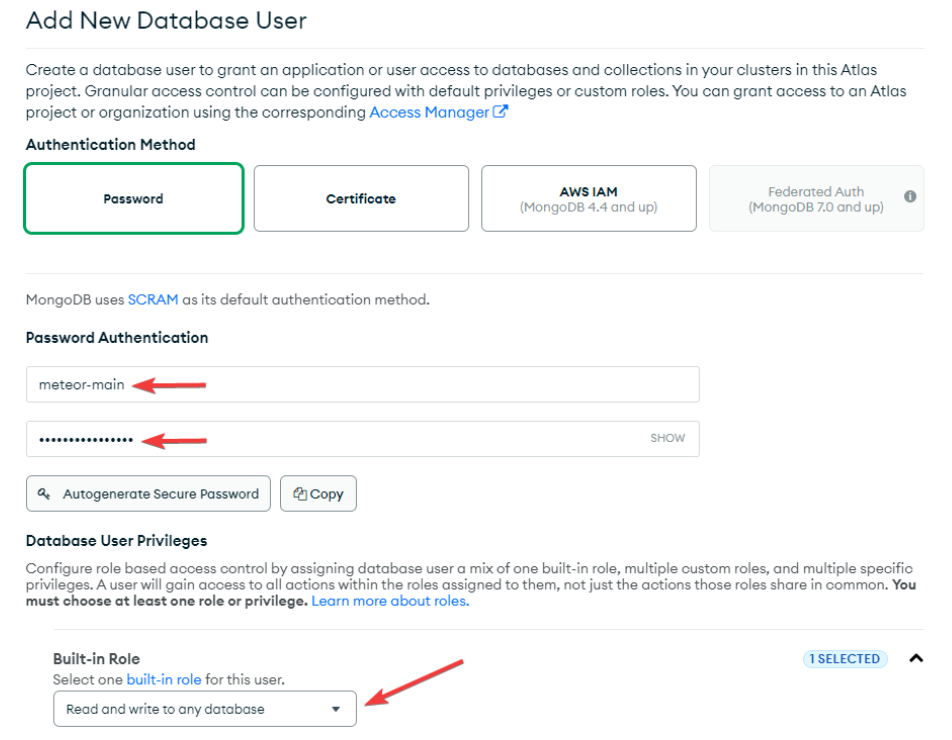

# Behind-The-Veil - Project 10 - FIT3170 - 2024

Behind the Veil is currently hosted at: https://behind-the-veil-1077153890194.australia-southeast2.run.app/

## Table of Contents
- [Dependencies](#dependencies)
- [Running the app](#running-the-app)
- [Versioning Strategy](#versioning-strategy)
- [Testing](#testing)
- [Errors](#errors)
- [Importing Mock Data](#how-to-import-the-mock-data-into-mongodb)
- [Git Help](#git-help)
- [Deployment](#deployment)
- [Team Composition](#team-composition)

## Dependencies

### Meteor

Reference: https://docs.meteor.com/install.html

> Meteor requires a certain version of node to be installed.
> specifically Node.js version >= 10 and <= 14 is required.

#### Installing V14 with Node Version Manager (NVM)

Meteor recommends to use nvm to install the correct version: https://github.com/nvm-sh/nvm

Install NVM:

- Use curl. This works on macOS or Linux.
  ```console
  curl -o- https://raw.githubusercontent.com/nvm-sh/nvm/v0.35.3/install.sh | bash
  ```
- Use Brew on macOS.
  ```console
  brew install nvm
  ```
- On Windows

  Follow the instructions on this link: https://www.freecodecamp.org/news/nvm-for-windows-how-to-download-and-install-node-version-manager-in-windows-10/

#### Downgrading Node.js

If you already installed Node.js and need to downgrade:

```console
npm install -g n
```

```console
n 14
```

To check if the version installed successfully run:

```console
node -v
```

#### Installing Meteor

For Windows, Mac or Linux run the following:

```console
npm install -g meteor
```

### React

Installing meteor already installs React so you don't need to do anything!


### Email SMTP Server
Certain functions in the application require the ability to send emails, thus these third-party 
dependencies that support this function must be set up.

The application also requires a simple mail transfer protocol (SMTP) server for functionalities that send emails. 
The project currently uses an SMTP server provided by Twilio SendGrid, but this SMTP server can be from any provider.

#### Prerequisite
You must already have a Gmail account for the application to send emails FROM. (Some organisational accounts 
cannot be used, including Monash emails.) 

The current email that the project is using is: behindtheveil010@gmail.com

This will form one of the environment variable required:

```console
FROM_USER:
"Nickname<email_address>"
```

e.g.:

```console
FROM_USER:
"Behind the Veil<behindtheveil010@gmail.com>"
```

#### Set up Twilio SendGrid SMTP Server
The following steps will take you through setting up an SMTP server on Twilio SendGrid:

1. Create and verify your account

Registration at: https://sendgrid.com/en-us

The Twilio team may reach out for manual verification of identity. You will need to provide details about yourself, 
your company/organisation, what you will be using email service for, etc.

2. Once your account is verified, log in and add a Single Sender at: https://app.sendgrid.com/settings/sender_auth
   - add the email address of the gmail account you have prepared during the prerequisite step.
   - this email address is used for the application to send emails FROM 


3. Verify the email address by accessing the inbox and clicking the link sent by Twilio.


4. Go to the setup guide for integration and select "SMTP Relay": https://app.sendgrid.com/guide/integrate



5. Create a new API key and record the password



6. Continue onto the nest steps and obtain the full SMTP connection. It should be something like this:

```console
MAIL_URL: 
"smtps://apikey:<YOUR_API_KEY>@smtp.sendgrid.net:465"
```

This is one of the required environment variables.


### Cloud MongoDB Database (MongoDB Atlas)
The application uses a cloud MongoDB database for storing and syncing data across devices. 
The following instructions will help you create a cluster for the project and set up the cloud MongoDB connection.

1. Create and verify your account for MongoDB Atlas at: https://account.mongodb.com/account/register


2. Log in and create a new project. (optional: invite other team members to the project)



3. Create a new (free) M0 cluster and name it anything you want


4. Follow the prompts to create a first admin user for the cluster


5. In "Network Access" tab, press "+ Add IP Address" and add "0.0.0.0/0" (this will allow access to the database from anywhere)


6. In "Database Access" tab, press "+ Add New Database User"
   - create a new user with: read-write permissions. 
   - Make sure you record the username and password




7. In the "Database" tab, press "Connect" on the cluster


8. Select "Drivers" and then copy the connect string (URI). 
   - Replace the <db_username> and <db_password> with the username and password of the user created in step 6.


9. You now have the other required environmental variable for connecting to the cloud database. It should look something like:
```console
MONGO_URL:
"mongodb+srv://<db_username>:<db_password>@cluster0.d0qmc.mongodb.net/meteor?retryWrites=true&w=majority&appName=Cluster0"
```


---

## Running the app

Once all your dependencies have been installed:

- Make sure you are in the behind-the-veil-siteroot directory
  ```console
  cd behind-the-veil-siteroot
  ```
- Install meteor dependencies inside the file. This will create your node_modules file, do not skip this step.️
  ```console
  meteor npm install
  ```
- To start the app with LOCAL database run:
  ```console
  meteor npm start
  ```

- To start the app with email server AND cloud database export the environment variables that we have created just before.
  (Currently, the variables has placeholders, please make sure to replace them with the actual values.)
  ```console
  export FROM_USER="Nickname<email_address>"
  export MAIL_URL="smtps://apikey:<YOUR_API_KEY>@smtp.sendgrid.net:465"
  export MONGO_URL="mongodb+srv://<db_username>:<db_password>@cluster0.d0qmc.mongodb.net/meteor?retryWrites=true&w=majority&appName=Cluster0"

  meteor npm start
  ```
  
  Your app should automatically open on the browser. If it doesn't, the console will show you a link that the app is running on the browser from so click this.
---
## Versioning Strategy

This strategy outlines how we manage versions in our project to ensure consistency and cohesion across the team for major releases, minor fixes and patching bugs.

Version Number Format:

We use Semantic Versioning to indicate changes in the project. The format follows `v[MAJOR].[MINOR].[PATCH]`.
- MAJOR: Incremented when significant new features are added to the application. This release is also used for major API changes and features that may require the end user to learn or relearn how to use new feature. i.e New settings page or a new side bar is added etc. 
> For example: v2.0.0
- MINOR: Incremented when less signification new features or improvements are added. These do not break existing functionality but introduce enhancements. i.e Theme changes, button changes and other minor features.
> For example: v1.1.0
- PATCH/BUG: Incremented when bug fixes are made. These changes do not affect functionality but resolve issues existing in the code. i.e bookings are being duplicated or multiple copies of the same services are added at a time.
> For example: v1.0.1

### Versioning Guidelines:
1. Initial Development:
- During the early stages of the project (pre-launch), the code was predominantly being developed on the `develop` branch hence no versioning was used for this. Once the project is stable and ready for release, we begin with 1.0.0.
2.	Branch-Based Development:
- All development is done on develop branches, and versions are assigned when merging back into the main branch (typically main or release).
- Each version release includes a tag in the repository with the version number, which serves as a snapshot of that point in development.
3. Changelog:
- A changelog must be maintained to document significant changes between versions. It should outline:
  - New features: new code added for functionality
  - Bug fixes: Fixes on existing code
  - Chores: maintenance work particularly for tech debt, cleaning up or documentation
4. Release Management:
- All version releases are tagged and documented with a description of the changes in the repository. Tagging allows easy reference to specific versions for debugging or comparison.
5. Post-Release Process:
- After each release, increment the version number according to the next expected update. For example, after releasing 1.2.0, the next patch might be 1.2.1 or the next minor update could be 1.3.0.
---
## Testing

```console
meteor test --driver-package meteortesting:mocha
```

## Errors

> In the event your app is crashing or failing to run, scroll up on the error message and it will tell you if you are missing any dependencies.

The most common missing one is Babel, so run this if you see it say missing babel package

```console
meteor npm install --save @babel/runtime react react-dom
```

> In the event that the app will not start due to "Unexpected mongo exit code 14":

- Try:
  meteor reset
  meteor
  credit: https://stackoverflow.com/questions/38988365/meteor-unexpected-mongo-exit-code-14-restarting-cant-start-mongo-server

## How to import the mock data into MongoDB

1. Download the "MongoDB Command Line Database Tools" from: https://www.mongodb.com/try/download/database-tools

2. Unzip and move the folder to anywhere you want (NOT inside the project folder).

3. Get the path of the `/bin` folder inside the unzipped folder. The full path should be something like: `C:\Program Files\MongoDB\mongodb-database-tools\bin`


Then add the above folder path to environment PATH.

### How to add to PATH

#### For windows

1. Start menu type: "path", and go into: `Edit system environment variables`

- 

2. press `Environment Variables`

- 

3. Go into the Path variable for **your user** not the **System variable**. Double click to expand the view.

- 

  3.5. Recommended/Optional step: backup your Path variable before you alter it to prevent any loss than may occur.

- 
- 
- copy this string to any text file or anywhere to save it on your computer for future.

4. Press the `New` button or any empty row and paste the previously copied path into it.

- 
- 

#### Mac

edit the file at `/etc/paths` and add the above address to the end of the file

1. running this command: `sudo vim /etc/paths`
2. press `i` to go into insert mode and writing in the file
3. paste in your path you want to add at the end on a new line
4. press `escape` and then type `:wq` to save the file


### Importing the files on LOCAL database

1. run meteor project (make sure it is started)


2. Open another terminal and navigate to site-root `\Behind-The-Veil\behind-the-veil-siteroot`

Run command:

```
mongoimport -h localhost:<PORT> --db meteor --collection <COLLECTION_NAME> --file <FILEPATH/FILENAME.json> --jsonArray
```

in the above command, replace:

- `<PORT>` with the port that the mongoDb is running on, if your meteor project is on 3000, then it is most likely 3001
    - (note: if you've run meteor on a different port, then mongoDb is probably running on that port + 1, e.g. meteor running on 4000, mongoDb running on 4001)
- `<COLLECTION_NAME>` with the database entity name (such as user, service, image, etc.)
- `<FILEPATH/FILENAME.json>` with the file path to the file to import

Note: do not include the angled brackets (< and >)

Example commands to import everything (with port 3001)

```
mongoimport -h localhost:3001 --db meteor --collection services --file mockdata/services15.json --jsonArray
mongoimport -h localhost:3001 --db meteor --collection services --file mockdata/services50.json --jsonArray

mongoimport -h localhost:3001 --db meteor --collection users --file mockdata/artists50.json --jsonArray
mongoimport -h localhost:3001 --db meteor --collection users --file mockdata/brides50.json --jsonArray

mongoimport -h localhost:3001 --db meteor --collection bookings --file mockdata/bookings12.json --jsonArray

mongoimport -h localhost:3001 --db meteor --collection images --file mockdata/user_images50.json --jsonArray
mongoimport -h localhost:3001 --db meteor --collection images --file mockdata/service_images100.json --jsonArray
mongoimport -h localhost:3001 --db meteor --collection images --file mockdata/galleryImages50_abc.json --jsonArray
mongoimport -h localhost:3001 --db meteor --collection posts --file mockdata/post50_abc.json --jsonArray
mongoimport -h localhost:3001 --db meteor --collection reviews --file mockdata/reviews12.json --jsonArray
```

### Importing the files on CLOUD database
1. run meteor project (make sure it is started) and remember to export the MONGO_URL to conect to the cloud database


2. Open another terminal and navigate to site-root `\Behind-The-Veil\behind-the-veil-siteroot`


run the command:

```text
mongoimport --username <CLOUD_USERNAME> --password <CLOUD_PASSWORD> <HOST_URI> --db meteor --collection <COLLECTION_NAME> --file <FILEPATH> --jsonArray
```

in the above command, replace:

- `<CLOUD_USERNAME>` with the username of the Cloud MongoDB Database user (refer to step 6 in: [here](#cloud-mongodb-database-mongodb-atlas))
- `<CLOUD_PASSWORD>` with the password of the Cloud MongoDB Database user (refer to step 6 in: [here](#cloud-mongodb-database-mongodb-atlas))
- `<HOST_URI>` with the first part of the connection string, should be something like: `mongodb+srv://cluster0.xxxxxxx.mongodb.net`
- `<COLLECTION_NAME>` with the database entity name (such as user, service, image, etc.)
- `<FILEPATH/FILENAME.json>` with the file path to the file to import

Note: do not include the angled brackets (< and >)

Example:
```text
mongoimport --username meteor-main --password xxxxxx mongodb+srv://cluster0.d99ecyx.mongodb.net --db meteor --collection test --file mockdata\presentation\artists50.json --jsonArray
```


## Git Help
  
 This file is for all the git issues and their resolution that I've come across before, more than welcome to add to it if you find a solution online to an issue you've had.

### Rebasing 
Reference: https://git-scm.com/book/en/v2/Git-Branching-Rebasing

✅ Step by Step video: https://youtu.be/RGtwxYqkkas?si=nvmMetHWNMegc0v_&t=129 (This guy does it all in his main terminal but i recommend using the IDE terminal so you can see your conflict files)

> **When to use rebasing:** When a new ticket has been merged to develop and your branch is not up to date with the develop branch
> 
> **Why do we rebase?** We want to limit the amount of merge conflicts happening in develop so we put all new changes from develop into our own branchs so we can resolve merge conflicts remotely instead of on develop.
> 
> **_! IMPORTANT !_** We will be prioritising develop branch over yours, so if a merge conflict occurs in develop, it will be rolled back and your changes will be lost, so please make sure you rebase!

#### Steps to rebase

##### Step 1: Stage and Commit your current changes in your local branch. Remember 
```console
git add <filename>
```
or
```console
git add .
```
then
```console
git commit -m "your message"
```

##### Step 2: Push local changes to your remote branch
```console
git push
```

##### Step 3: checkout the develop branch
```console
git checkout develop
```

##### Step 4: pull all recent changes from remote develop to your local develop branch
```console
git pull
```

##### Step 5: Go back to your working remote branch and rebase
```console
git checkout <your working branch>
```

```console
git rebase develop
```
#### Rebasing Merge conflicts
When rebasing you may run into merge conflicts. In this scenario, your terminal will say something like this:
```console
error: could not apply fa39187... something to add to patch A

When you have resolved this problem, run "git rebase --continue".
If you prefer to skip this patch, run "git rebase --skip" instead.
To check out the original branch and stop rebasing, run "git rebase --abort".
Could not apply fa39187f3c3dfd2ab5faa38ac01cf3de7ce2e841... Change fake file
```
This occurs because one or more of your files is going to be overwritten from the rebase. 
Your terminal will tell you which files are having a conflict. However you can also do cmd/ctrl + shift + f and search '<<<<<<< HEAD'.

A merge conflict typically looked like this:
```javascript
    /**
    * This comment is from your working branch
    */
```
The way to resolve this is to select from the middle '=====' and either delete everything above it or below it. Make sure you delete the remaining >>> or <<< as well.

Once your resolve the conflict in the file remember to stage your changes
```console
git add <changed filename>
```

then continue rebasing to see if any other files need to be resolved:
```console
git rebase --continue
```

⚠️ **! IMPORTANT !** ⚠️Sometimes your rebase will ask you to write a commit message. If this occurs. Simply press cmd/ctrl + X to get out of message writing mode and continue rebasing.

✅ **You will know your rebase was successful if your terminal says rebased successfully.**

If everything in your branch is working to your expectations and you are happy with you current branch then do
```console
git push -f
```

Keep in mind git force push will rewrite your remote branch with everything in local regardless of merge conflicts. This is not a bad thing if you are happy with everything on your local and need your remote to match!
----

### Changing Branch name remotely and locally
Reference: https://stackoverflow.com/questions/30590083/git-how-to-rename-a-branch-both-local-and-remote

Rename the local branch to the new name
```console
git branch -m <old_name> <new_name>
```

Delete the old branch on remote - where <remote> is, for example, origin
```console
git push <remote> --delete <old_name>
```

Or shorter way to delete remote branch [:]
```console
git push <remote> :<old_name>
```

Prevent git from using the old name when pushing in the next step. Otherwise, git will use the old upstream name instead of <new_name>.
```console
git branch --unset-upstream <new_name>
```

Push the new branch to remote
```console
git push <remote> <new_name>
```

Reset the upstream branch for the new_name local branch
```console
git push <remote> -u <new_name>
```

### Git push errors
> error: src refspec feature/86cv1cexu-git-repo-setup does not match any \
> error: failed to push some refs to 'https://github.com/Monash-FIT3170/Behind-The-Veil.git'

This error means the branch doesn't exist in remote but does locally. To resolve this you can do a git status to see what uncommitted files you have and commit them. Do a git push and the branch should push to remote and create it for you.

---

### Merge Request Issues
#### Git doesn't give me the option to merge into developer branch?
This means the branch you are trying to push has a detached head i.e it was never branched off the developer branch.

To resolve this go into your current working branch and run
```console
git rebase develop
```

Resolve any conflicts that may occur and do add all changed files using 
```console
git add <filename> # recommended
```
or 
```console
git add . # not recommended unless you are confident you want ALL files staged
```

Finally to attach your branch back to head with all changes do

```console
git push -f
```

**Note** if you are unsure about any of this please reach out to team members via General.

## Deployment

This section outlines how to manually deploy the app using Docker and Google Cloud Platform (GCP). The steps outlined are more specific to our app and workflow, but for general advice and more specific details on how to deploy using GCP, refer to https://cloud.google.com/run/docs/deploying

If you modify the Dockerfile, keep in mind that GCP requires containers to follow this contract https://cloud.google.com/run/docs/container-contract (“Executables in the container image must be compiled for Linux 64-bit. Cloud Run specifically supports the Linux x86_64 ABI format.”)

Note that these steps could probably be optimised, i.e. pushing Docker image straight to Artifact Registry instead of Dockerhub first.

### Prerequisites:

#### Docker:
1. Install Docker and create a Docker account, then have the Docker engine running when attempting to build the Docker image
2. Create a Dockerhub repo

#### GCP:
1. Create Google Cloud project and enable billing
2. Set up Artifact Registry
    - Enable Artifact Registry API
    - Go to Artifact Registry > Repositories
    - Create a docker repository
      - In the form, select docker format and Australia region
3. Configure secrets using Secret Manager
    - Enable Secret Manager API
    - Create secrets for each of our sensitive environment variables, e.g.
      - MONGO_URL
      - MAIL_URL
      - FROM_USER
    - Grant the ’Secret Manager Secret Accessor’ role to the service account being used to deploy
      - Go to Secret Manager page
      - ‘Show info panel’
      - ‘Add principal’
      - Select the service account used to deploy as new principal
      - Select ’Secret Manager Secret Accessor’ as role

### Steps:

Assuming you have completed the prerequisites, here is the process when you’re ready to do a release and deploy:

1. Create a branch off of ‘develop’ called ‘release/<version_number>’ (replace with your desired version number)
2. Merge ‘release/<version_number>’ into ‘main’
3. Checkout ‘main’ branch
4. Open terminal. Go to behind-the-veil-siteroot, where the Dockerfile is
    ```console
    cd behind-the-veil-siteroot
    ```
5. Log in
   ```console
   docker login
   ```
    - Enter login credentials
6. Build the Docker image
   ```console
   docker buildx build -t behind-the-veil --platform linux/amd64 .
   ```
7. Test that the image runs locally
   ```console
   docker run -e MONGO_URL=<mongo_url> -e ROOT_URL=<root_url> -e MAIL_URL=<mail_url> -e FROM_USER=<from_user_email> -p 8080:8080 behind-the-veil
   ```
    - Replace the environment variables above with our potentially sensitive values, or omit them if you know you don’t need them for testing
    - If it fails, then debug, rebuild, and test again, else proceed

Note, the following example code snippets assume the following:
  - Docker username = joshualoongwy
  - Dockerhub repo name = behind-the-veil
  - Version number = 2.0.1
  - GCP project location = australia-southeast2
  - GCP project id = behind-the-veil
  - GCP Artifact Registry repo name = behind-the-veil-docker

***Adjust each command according to your needs***

8. Tag Docker image to target Dockerhub repo
    ```console
    docker tag behind-the-veil joshualoongwy/behind-the-veil:2.0.1
    ```
9. Push Docker image to Dockerhub repo
    ```console
    docker push joshualoongwy/behind-the-veil:2.0.1
    ```
10. Go to GCP and open Cloud Shell. The following steps are performed in a Cloud Shell terminal. Configure authentication if necessary
    ```console
    gcloud auth configure-docker australia-southeast2-docker.pkg.dev
    ```
11. Pull Docker image from Dockerhub
    ```console
    docker pull joshualoongwy/behind-the-veil:2.0.1
    ```
12. Tag Docker image to target Google Artifact Registry repo
    ```console
    docker tag joshualoongwy/behind-the-veil:2.0.1 australia-southeast2-docker.pkg.dev/behind-the-veil/behind-the-veil-docker/behind-the-veil:2.0.1
    ```
13. Push Docker image to Google Artifact Registry
    ```console
    docker push australia-southeast2-docker.pkg.dev/behind-the-veil/behind-the-veil-docker/behind-the-veil:2.0.1
    ```
14. Go to Google Cloud Run and fill out service form
    - If first time deploying, go to ‘Create service’ and fill out Google Cloud Run form fields:
      - Container Image URL: Select the image you just pushed to Artifact Registry
      - Region: Select ‘australia-southeast2’
      - Authentication: Select ‘Allow unauthenticated invocations’
      - Environment variables: Use the necessary environment variables (some should be configured as secrets in Secret Manager), e.g.
        - ROOT_URL
        - MONGO_URL
        - MAIL_URL
        - FROM_USER
      - Increase/adjust resources (e.g. memory) as necessary
    - If redeploying, select your existing service and go to ‘Edit & deploy new revision’, then make necessary changes in the form
15. Press ‘Deploy’, wait for GCP to deploy, then go the supplied URL to check for successful deployment


## Team Composition

- Phillip (Kefei) Li
- Glenn Eric
- Lucas Sharp
- Laura Zhakupova
- Vicky Huang
- Anusha Yadav
- Katie (Kathryn) Mitchell
- Joshua Loong
- Trung Nguyen
- Hirun Hettigoda
- Nishan Chakma
- Nikki Li Shao
- Ryan Hicks
- Neth Botheju
- Kyle Bibby
- Nhu Nguyen

## Readme Authors
Written & tested by Neth, Josh and Nikki  
Mongo error help info added added by Phillip
