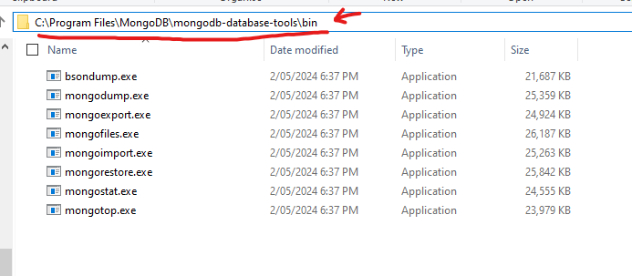
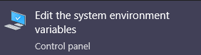
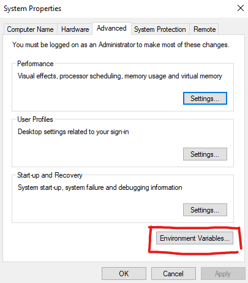
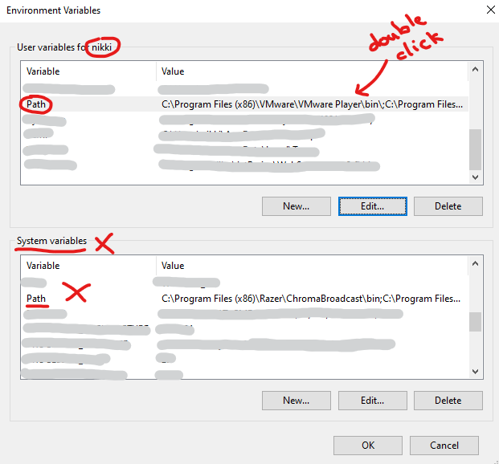
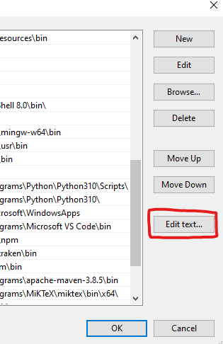
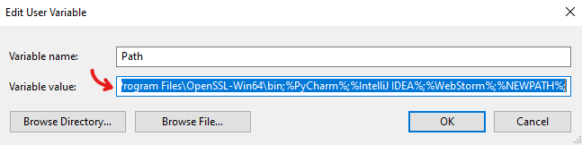
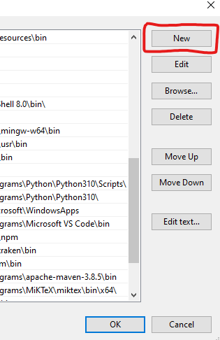

# How to import the mock data into MongoDB

1. Download the "MongoDB Command Line Database Tools" from: https://www.mongodb.com/try/download/database-tools

2. Unzip and move the folder to anywhere you want (NOT inside the project folder).

3. Get the path of the `/bin` folder inside the unzipped folder. The full path should be something like: `C:\Program Files\MongoDB\mongodb-database-tools\bin`



Then add the above folder path to environment PATH.

# How to add to PATH

## For windows:

1. Start menu type: "path", and go into: `Edit system environment variables`

- 

2. press `Environment Variables`

- 

3. Go into the Path variable for **your user** not the **System variable**. Double click to expand the view.

- 

  3.5. Recommended/Optional step: backup your Path variable before you alter it to prevent any loss than may occur.

- 
- 
- copy this string to any text file or anywhere to save it on your computer for future.

4. Press the `New` button or any empty row and paste the previously copied path into it.

- 
- 

## Mac

edit the file at `/etc/paths` and add the above address to the end of the file

1. running this command: `sudo vim /etc/paths`
2. press `i` to go into insert mode and writing in the file
3. paste in your path you want to add at the end on a new line
4. press `escape` and then type `:wq` to save the file

- don't have access to a Mac, try to google for more specific instructions.

# Importing the files

1. run meteor project (make sure it is started)

2. Open another terminal and navigate to site-root `\Behind-The-Veil\behind-the-veil-siteroot`

Run command:

```
mongoimport -h localhost:PORT --db meteor --collection COLLECTION_NAME --file FILENAME.json --jsonArray
```

in the above command, replace:

- `PORT` with the port that the mongoDb is running on, if your meteor project is on 3000, then it is most likely 3001
- `COLLECTION_NAME` with the database entity name (such as user, service, image, etc.)
- `FILENAME.json` with the file path to the file to import

Example commands to import everything (with port 3001)

```
mongoimport -h localhost:3001 --db meteor --collection services --file mockdata/services15.json --jsonArray
mongoimport -h localhost:3001 --db meteor --collection services --file mockdata/services50.json --jsonArray

mongoimport -h localhost:3001 --db meteor --collection users --file mockdata/artists50.json --jsonArray
mongoimport -h localhost:3001 --db meteor --collection users --file mockdata/brides50.json --jsonArray

mongoimport -h localhost:3001 --db meteor --collection bookings --file mockdata/bookings12.json --jsonArray

mongoimport -h localhost:3001 --db meteor --collection images --file mockdata/user_images50.json --jsonArray
mongoimport -h localhost:3001 --db meteor --collection images --file mockdata/service_images100.json --jsonArray
mongoimport -h localhost:3001 --db meteor --collection images --file mockdata/post_images_user30.json --jsonArray
mongoimport -h localhost:3001 --db meteor --collection posts --file mockdata/post_user50.json --jsonArray
mongoimport -h localhost:3001 --db meteor --collection images --file mockdata/post_images_user50.json --jsonArray
mongoimport -h localhost:3001 --db meteor --collection images --file mockdata/abs_image_post_user50.json --jsonArray
```

mongoexport -h localhost:3001 --db meteor --collection images --out=output.txt

```

```
